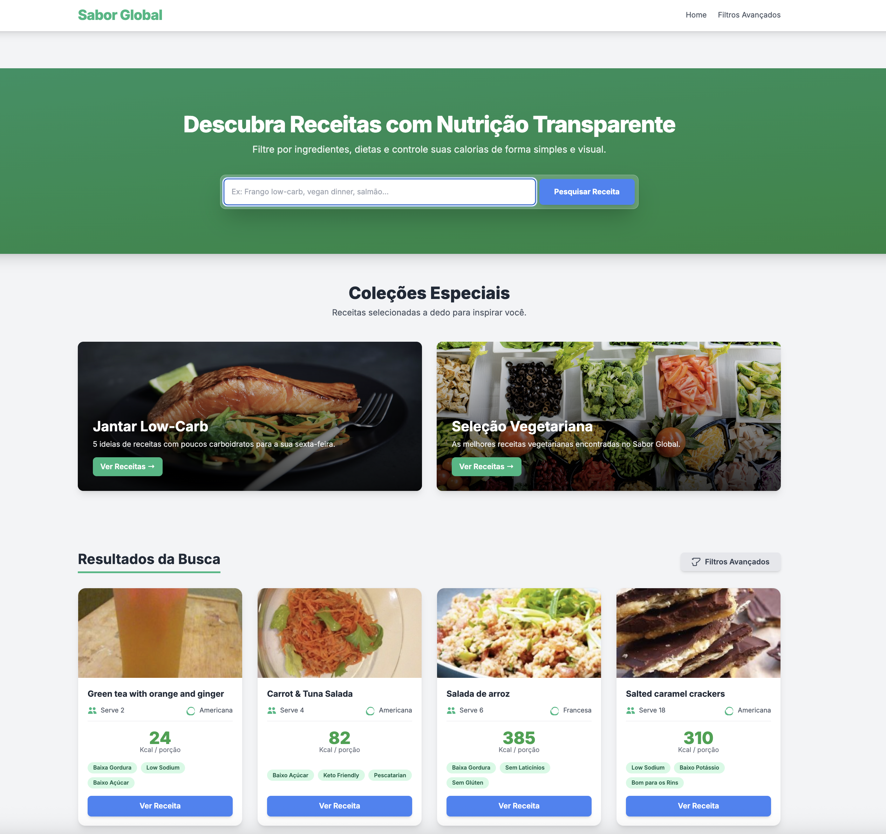

# Sabor Global 🍳

Uma plataforma de descoberta de receitas com um dashboard nutricional claro e intuitivo.

### 🔗 **[Acesse a versão ao vivo aqui!](https://www.saborglobal.com.br/)**



## 💡 Sobre o Projeto

Sabor Global é uma interface web moderna que consome a API da Edamam para ajudar usuários a encontrar receitas de todo o mundo. O diferencial do projeto é a apresentação clara e objetiva das informações nutricionais, além de filtros avançados e coleções de receitas selecionadas para inspirar os usuários na cozinha.

## ✨ Funcionalidades

* **Busca Dinâmica:** Pesquise receitas por qualquer ingrediente.
* **Filtros Avançados:** Refine os resultados por calorias, dietas e restrições de saúde.
* **Dashboard Nutricional:** Cards de receita com informações essenciais de fácil visualização.
* **Coleções Especiais:** Seções de curadoria com sugestões de buscas temáticas.
* **Interface Responsiva:** Experiência otimizada para desktops, tablets e celulares.

## 🛠️ Tecnologias Utilizadas

O projeto foi construído com foco em tecnologias front-end modernas e uma arquitetura serverless para segurança.


<details>
  <summary>Instruções para Executar Localmente</summary>
  
  1. **Clone o repositório:**
     ```bash
     git clone [https://github.com/silvatechf/sabor-global-site.git](https://github.com/silvatechf/sabor-global-site.git)
     ```
  2. **Navegue até a pasta do projeto:**
     ```bash
     cd sabor-global-site
     ```
  3. **Abra o `index.html` em seu navegador.**
     - _Nota: Para a busca de receitas funcionar, é necessário obter suas próprias chaves da [Edamam API](https://developer.edamam.com/) e configurar o projeto para usá-las._
</details>

## 👨‍💻 Contato

**Fernando da Silva Felix**

* **GitHub:** [@silvatechf](https://github.com/silvatechf)
* **LinkedIn:** https://www.linkedin.com/in/fernando-silva-83b155a4/

---
